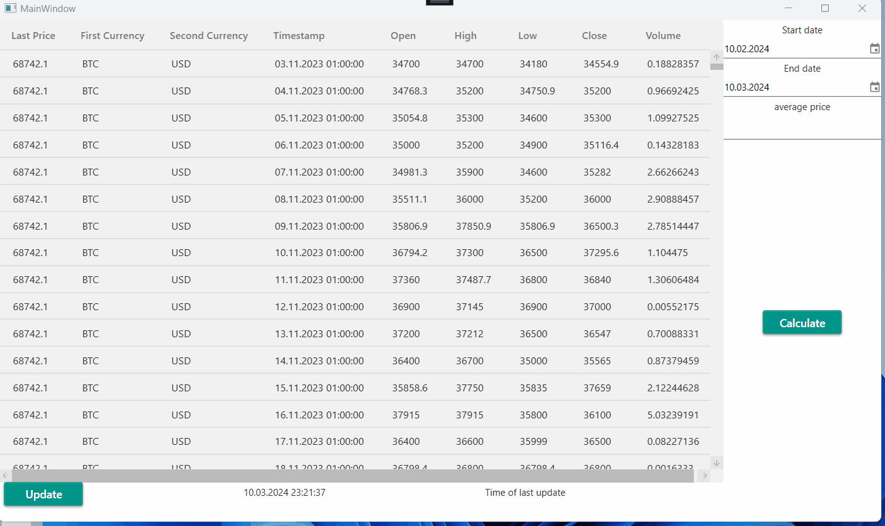

# BitcoinQuery

## Client-server application for retrieving and querying the daily closing prices of bitcoin in US-Dollar

Client-server application for retrieving and querying the daily closing prices of bitcoin in US-Dollar for the last 31 days in a C#.NET desktop application. To obtain the BTC/USD daily closing prices, the following API is used: [https://cex.io/rest-api](https://cex.io/rest-api).

---

For more flexibility and scalability, as well as future support, the application is divided into client-server architecture. This allows for extension and refinement of the client part using service or microservice architecture. Additionally, it facilitates the development of clients in different programming languages and for various platforms, such as Vue.js/Angular/React, Avalonia/Windows Forms/Electron/ASP.NET MVC (Core). The server-side can be scaled by adding new microservices for each function. The code is written with clarity and readability in mind, and significant code sections are logged, with logs output to files by date.

Unit tests are provided for critical areas of server services, and some tests are included for the client-side. Standard REST API methods are used for data exchange between the client and server. To update data once a day, the Hangfire task manager is utilized on the server-side, and to update content on the client, a PUSH messaging method from the server is employed. This method notifies the client-side, which then requests new data via REST API from the server.

Given the nature of this test project, no data access layers, UnitOfWorks, or repositories are implemented, and database handling is omitted. However, adding a database such as CosmosDB would be straightforward when scaling. Also, I did not add any authorization methods (Basic, JToken e.g) in this test task project. Data retrieved from cex.io is stored in memory cache, which aids in calculating the average value of Bitcoin closing without unnecessary requests to the cex.io server. Hangfire InMemory library is used to store task manager data. All applications are highly configurable via configuration files.

## Client-side

A modern desktop application is developed using C# WPF, following a pure MVVM pattern without any third-party MVVM frameworks and libraries.



### Technology:
- .NET Framework 4.8
- WPF
- NLog
- Material Design Themes for modern UI
- Autofac
- RestSharp
- SignalR
- Unit Tests (NUnit)

## Server-side

A modern microservice is implemented using C# .NET 8.

### Technology:
- .NET 8
- NLog
- RestSharp
- Hangfire
- SignalR
- Unit Tests (NUnit)

## Configuring Client-side

All configuration fields are included in `App.config`.

```xml
<appSettings>
  <add key="serverUriString" value="https://localhost:7186/api/BitcoinPrice" />
  <add key="serverPushUriString" value="https://localhost:7186/newdatafire" />
  <add key="timeOut" value="-1" />
</appSettings>
```
- serverUriString: URL for the Bitcoin data controller.
- serverPushUriString: URL for kicking the client when new data on the server has been obtained.
- timeOut: Timeout for thin configuration (disabled in this case).

## Configuring Server-side

All configuration fields are included in appsettings.json.
```json
"CexApi": {
  "BaseUrl": "https://cex.io/api/",
  "Timeout": -1,
  "FirstCurrency": "BTC",
  "SecondCurrency": "USD"
}
```
